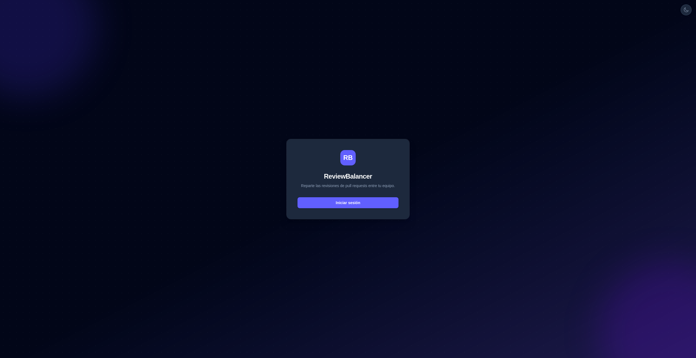
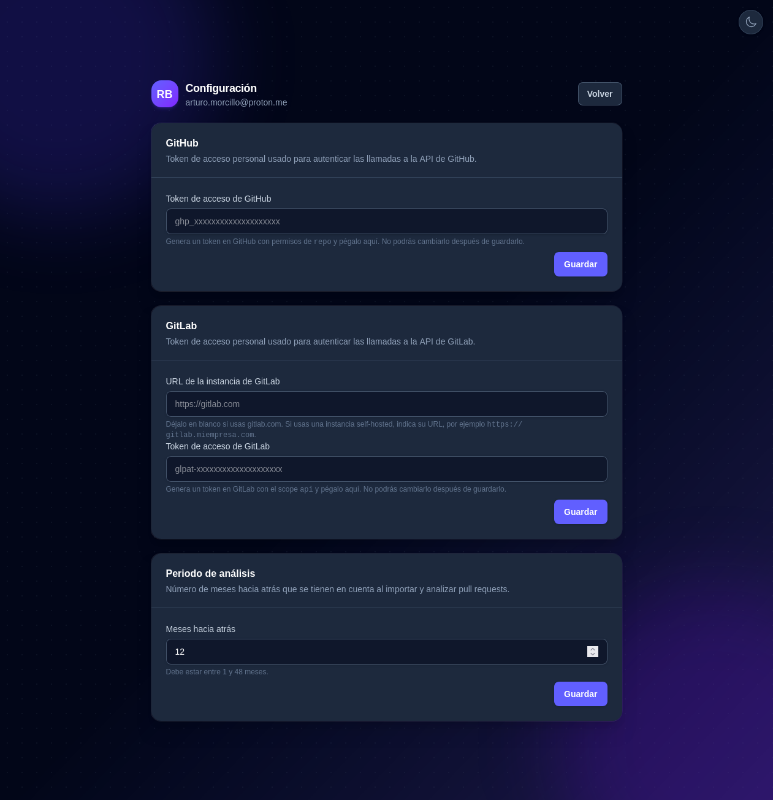
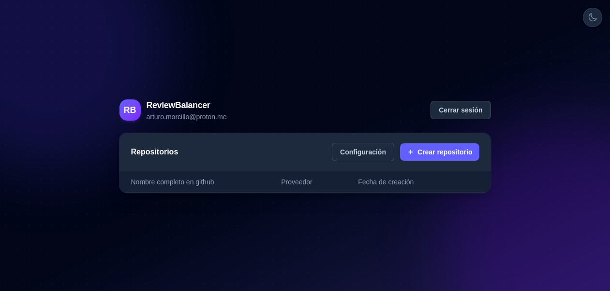
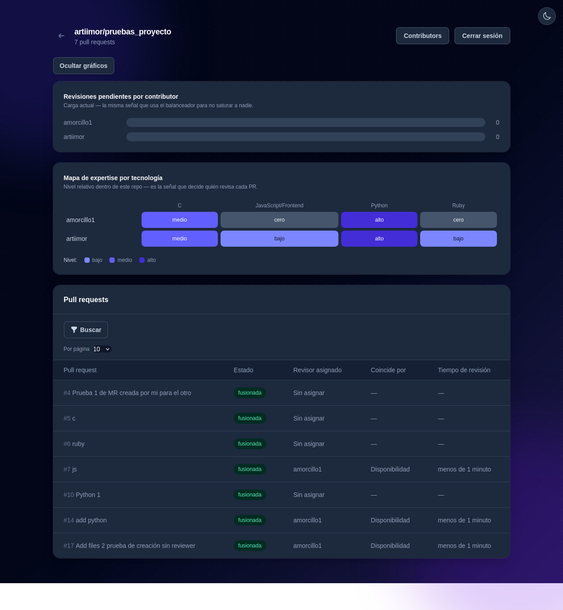

# Review Balancer:
esp🇪🇸: Review balancer te permite asignar automáticamente los revisores a las PRs que hagas tanto en github como el github.

en🇺🇸/🇬🇧: Reviewer balancer allows you to automatize the asssignation of reviewer for your PRs in github as well as in gitlab.

## Primeros pasos / First steps
esp🇪🇸: Lo primero que tienes que hacer es levantar el proyecto. Con ejecutar un

en🇺🇸/🇬🇧: The first thing you need to do is get the project up and running. By executing:
```
cp .env.example
docker-compose build
docker-compose up -d
```
esp🇪🇸: Deberías tener el proyecto levantado y si accedes a `localhost:3000` deberías ver algo parecido a esto

en🇺🇸/🇬🇧: You should have the project up and running, and if you access `localhost:3000` you should see something like this


esp🇪🇸: Para terminar crear la base de datos, correr las migraciones y ejecutar una pequeña rake:

en🇺🇸/🇬🇧: To finish, create the database, run the migrations and execute a small rake task:
```
docker-compose exec web bundle exec rails db:create
docker-compose exec web bundle exec rails db:migrate
docker-compose exec web bundle exec rake file_extension_mappings:seed
```

### Posibles problemas / Possible issues
esp🇪🇸: Si no se cargan los estilos deberías revisar bien el fichero `.env` y asegurarte que el environment es el de `development`

en🇺🇸/🇬🇧: If the styles don't load, you should carefully check the `.env` file and make sure the environment is set to `development`

## Creando el usuario y configurando lo necesario / Creating the user and configuring what's needed
esp🇪🇸: El siguiente paso será crear tu propio usuario y configurar los tokens de git. Necesarios para que se tenga acceso a ver los colaboradores, las PRs o los archivos que se han modificado.
Nada más autenticarte serás redireccionado a esta pantalla:

en🇺🇸/🇬🇧: The next step is to create your own user and configure your git tokens. These are needed to access collaborators, PRs, or the files that have been modified.
As soon as you authenticate you'll be redirected to this screen:


### Github: / Github:
esp🇪🇸: Accediendo a `https://github.com/settings/credentials` podrás ver un apartado donde pone `fine-grained personal access tokens`y en ese apartado crear un token.
*IMPORTANTE* El token tiene que tener acceso a los repositorios que quieres monitorear. Necesita permiso read-only para `contents`y Read and write para `pull requests`

Una vez generado el token se introduce en su apartado

en🇺🇸/🇬🇧: By going to `https://github.com/settings/credentials` you'll find a section called `fine-grained personal access tokens`, where you can create a token.
*IMPORTANT* The token needs access to the repositories you want to monitor. It requires read-only permission for `contents` and read and write for `pull requests`

Once the token is generated, enter it in its corresponding field

### Gitlab: / Gitlab:
esp🇪🇸: El funcionamiento es similar pero hay un pequeño detalle.
Tal y como indica, necesitas indicar la url de la instancia que tengas configurada.

Ten en cuenta que si tu instancia solo es accesible mediante VPN, se considerará privada y la protección contra SSRF bloqueará la conexión. Para solucionarlo, añade su hostname a tu fichero `.env` como `SSRF_ALLOWED_HOSTS`

en🇺🇸/🇬🇧: The process is similar but there's one small detail.
As indicated, you need to provide the URL of the instance you have configured

Keep in mind that if your instance is only accessible via VPN, it will be considered private and the SSRF protection will block the connection. To fix that, add its hostname to your `.env` file as `SSRF_ALLOWED_HOSTS`

### Periodo de análisis / Analysis period
esp🇪🇸: Al crear un repositorio en la aplicación se importarán todas las pull_requests para el análisis de estas junto a sus contributors. Aquí seleccionas los meses hacia atrás que se considerarán para esto

Cuando esté todo configurado puedes darle al botón de volver.

en🇺🇸/🇬🇧: When you create a repository in the application, all pull requests will be imported for analysis together with their contributors. Here you select how many months back should be considered for this

Once everything is configured, you can click the back button.

### Posibles problemas / Possible issues
esp🇪🇸: Es posible que no hayas generado las claves como indica el fichero `.env.example` Si no es así hazlo.

en🇺🇸/🇬🇧: You may not have generated the keys as indicated in the `.env.example` file. If that's the case, do so.

## Creando un repositorio / Creating a repository
esp🇪🇸: Una vez hechos los pasos anteriores deberías tener lo siguiente:

en🇺🇸/🇬🇧: Once you've completed the previous steps you should have the following:


esp🇪🇸: Y toca crear un repositorio. Solamente tienes que introducir el nombre del repositorio (Lo podrás encontrar en la URL), el webhook y por último si es un repositorio de github o de gitlab.

en🇺🇸/🇬🇧: Now it's time to create a repository. You just need to enter the repository name (you can find it in the URL), the webhook, and finally whether it's a github or gitlab repository.

### Creando el webhook / Creating the webhook

esp🇪🇸: Antes de proceder a crear el repositorio tenemos que crear el webhook. Paraa esto accederemos al proyecto en github o gitlab.

Para que funcione tenemos que darle permisos de pull requests para que en el momento de actualizarlas nuestro sistema que hacer con esta información.

en🇺🇸/🇬🇧: Before proceeding to create the repository we need to create the webhook. To do this we'll access the project on github or gitlab.

For it to work we need to grant pull request permissions so that, whenever they're updated, our system knows what to do with that information.

#### ¿A qué url lo apunto? / Which URL do I point it to?
esp🇪🇸: Toca apuntar a la url que tengais en vuestro equipo con `http://<TU_IP>:3000/webhooks/github`

en🇺🇸/🇬🇧: You have to indicate to your own url with `http://<YOUR_IP>:3000/webhooks/github`

## Dentro del repositorio / Inside the repository
esp🇪🇸: Una vez lo creemos nos aparecerá en el listado y podemos acceder a nuestro repositorio. Podemos ver que tenemos unos gráficos y que se han importado las PRs correspondientes si teníamos alguna:

en🇺🇸/🇬🇧: Once we create it, it will appear in the list and we can access our repository. We can see that we have some charts and that the corresponding PRs have been imported, if we had any:



esp🇪🇸: Aquí podemos ver todas las PRs, la carga de trabajo de cada contributor, su expertise y gestionar los contributors.

Cuando se cree una PR se asignará a un contributor basado en su disponibilidad y su expertise. Podemos cambiarlo desde la aplicación también si queremos que lo revise otra persona. Todas las asignaciones hechas o si se cambia desde git se sincroniza con nuestra aplicación

en🇺🇸/🇬🇧: Here we can see all the PRs, each contributor's workload, their expertise, and manage the contributors.

When a PR is created it will be assigned to a contributor based on their availability and expertise. We can also change this from the application if we want someone else to review it. All assignments made, or changes made from git, are synced with our application

## Apartado de contributors / Contributors section

esp🇪🇸: En este apartado podemos activar y desactivar contributors

También podemos gestionar sus vacaciones. Lo que implica que si se crea una PR y ese contributor está de vacaciones no se le asignará como revisor.

en🇺🇸/🇬🇧: In this section we can enable and disable contributors

We can also manage their vacation days. This means that if a PR is created while a contributor is on vacation, they won't be assigned as a reviewer.

## Licencia / License

esp🇪🇸: Este proyecto está publicado bajo la licencia MIT. Consulta el fichero [LICENSE](./LICENSE) para el texto completo.

en🇺🇸/🇬🇧: This project is released under the MIT License. See the [LICENSE](./LICENSE) file for the full text.